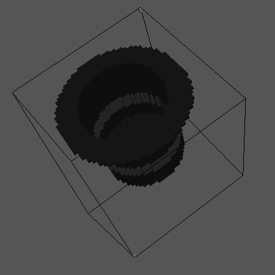

# Escultor 3D em C++

--- 

### 1. Introdução

Esse projeto consiste na criação de um escultor 3D interativo que gera figuras baseadas em cubos, criando sólidos similares a algo visto no jogo *minecraft*. O código desse projeto é desenvolvido inteiramenta em **C++** utilizarando primariamente o estilo de programação orientado a objeto(POO). 

Além da linguagem de programação C++, outras ferramentas para a vizualização das figuras geradas devem ser utilizadas, as recomendações são o **geomview** ou **meshlab**. Os softwares previamente citados foram escolhidos, pois possuem a capacidade de ler e representar arquivos do tipo **.OFF** que é o tipo de arquivo utilizado para se armazenar os sólidos feitos pelo programa em C++.

O tipo de arquivo .OFF é muito importante para esse projeto, pois ele é um arquivo que pode ser escrito de uma forma padronizada de maneira a ser possível a se denhar um solido 3D.

 

  

O desenvolvimento desse projeto consistirá em duas etapas, sendo elas:

- **ETAPA 1** - desenvolvimento das ferramentas de desenho 3D.
- **ETAPA 2** - Criação de uma ferramenta interativa.

### 2. Estrutura

O código é fragmentado em dois diretórios principais e um código "main.cpp". Os diretótios são responsáveis por armazenas os cabeçalhos e classes C++. No main podemos utilizar os recursos dos diretorios "include" e "src" que são as duas pastas principais. Os diretórios utilizados são os seguintes:

- **include** - retém os cabaçalhos(.hpp) da classe Sculptor e do Struct Voxel. A classe Sculptor é definido no arquivo Sculptor.cpp.

- **src** - possui o código da lógica e implementação da classe Sculptor.

*OBS.: vale salientar o diretório "models" que retém as figuras 3D geradas.*

### 3. Código

#### 3.1. Cabeçalhos

 O escultor 3D será, basicamente, uma matriz tridimensional a qual cada um de seus espaços contém um objeto do tipo "Voxel" que é uma representação de uma unidade de epaço 3D similar ao pixel no espaço 2D. A struct respectiva ao Voxel possui os atributos de cor RGB dados na forma de float e uma booleana que diz se o respectivo voxel está sólido ou não. Abaixo o código para o voxel:
 

~~~cpp
struct Voxel {
  float r,g,b; // Cores
  float a; // trasparência

  bool isOn; // solidez do voxel
};
~~~

Além da estrutura do voxels temos também a classe Sculptor que é responsável por construir o nossos canvas de desenhos e de criar as nossas figuras. Na Nessa classe teremos um atributo que será repectivo ao campo de desenho, sendo esse atributo uma matriz 3D do tipo Voxel. Além de atributos, temos métodos que tem o trabalho de desenhar formas geométricas, métodos que escolhem a cor do sólido que será desenhado e um método que escreve o arquivo .OFF. A baixo temos o código do cabeçalho da classe Sculptor:

~~~cpp
class Sculptor {
protected:

    int nx,ny,nz; // Dimensões do canvas
    float r,g,b,alfa; // Cores de desenho
public:
    Voxel ***v;// Matriz 3D de voxels

    Sculptor(int _nx = 1, int _ny = 1, int _nz = 1);
    ~Sculptor();

    void alocaMemoria();

    void setColor(float r_, float g_, float b_, float alpha_);

    // Métodos de desenho
    void putVoxel(int x, int y, int z);
    void cutVoxel(int x, int y, int z);
    void putBox(int x0, int y0, int z0, int l, int h, int w);
    void cutBox(int x0, int y0, int z0, int l, int h, int w);
    void putDisc(int xcenter, int ycenter, int zcenter, int r, int h, int axis = 1);
    void cutDisc(int xcenter, int ycenter, int zcenter, int r, int h, int axis = 1);
    void putSphere(int xcenter, int ycenter, int zcenter, int r);
    void cutSphere(int xcenter, int ycenter, int zcenter, int r);
    void putEllipsoid(int xcenter, int ycenter, int zcenter, int rx, int ry, int rz);
    void cutEllipsoid(int xcenter, int ycenter, int zcenter, int rx, int ry, int rz);

    //Método que escreve o arquivo OFF de acordo com a matriz v
    void writeOFF(char* filename);
};
~~~