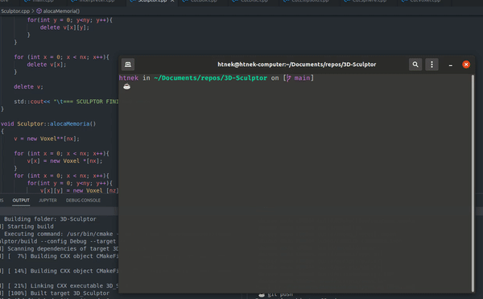

# Escultor 3D em C++

## Descrição 📎

<p align = "justify">
Esse projeto consiste na criação de um escultor 3D interativo que gera figuras baseadas em cubos, criando sólidos similares a algo visto no jogo *minecraft*. O código desse projeto é desenvolvido inteiramenta em <b>C++</b> utilizarando primariamente o estilo de programação orientado a objeto(POO). O projeto desenvolveu uma lingua simples para criação de sólidos, pode ser visto na pasta <a href="https://github.com/LuigiVanin/3D-Sculptor/tree/main/scripts">./scripts/</a>.
<p>

<p align = "justify">
Além da linguagem de programação C++, outras ferramentas para a vizualização das figuras geradas devem ser utilizadas, as recomendações são o <b>geomview</b> ou <b>meshlab</b>. Os softwares previamente citados foram escolhidos, pois possuem a capacidade de ler e representar arquivos do tipo <b>.OFF</b> que é o tipo de arquivo utilizado para se armazenar os sólidos feitos pelo programa em C++.

<p align = "justify">
O tipo de arquivo .OFF é muito importante para esse projeto, pois ele é um arquivo que pode ser escrito de uma forma padronizada de maneira a ser possível a se denhar um solido 3D.

<br>

<p align="center">
  
</p>

## Estrutura 📦

<p align = "justify">
O código é fragmentado em dois diretórios principais e um código "main.cpp". Os diretótios são responsáveis por armazenas os cabeçalhos e classes C++. No main podemos utilizar os recursos dos diretorios "include" e "src" que são as duas pastas principais. Os diretórios utilizados são os seguintes:
<p>

-   **include** - retém os cabaçalhos(.hpp) da classe Sculptor e do Struct Voxel. A classe Sculptor é definido no arquivo Sculptor.cpp.

-   **src** - possui o código da lógica e implementação da classe Sculptor.

-   **models** - pasta para armazenar os modelos .off gerados pelo programa.

-   **scripts** - pasta referente aos scripts para a construção de modelos 3d.
    _OBS.: vale salientar o diretório "models" que retém as figuras 3D geradas._

## Requisitos ❗

-   Git
-   GCC ~> 9.4.0
-   CMake ~> 3.16.3
-   Ubuntu

_OBS.:_ **O código pode facilmente rodar em outros sistemas**, porém só testei em meu ambiente, logo, não posso garantir nenhuma compatibilidade

## Como baixar e rodar 🚀

<p align="center">
  
</p>

## Como funciona ❓

#### - Cabeçalhos

<p align = "justify">
 O escultor 3D será, basicamente, uma matriz tridimensional a qual cada um de seus espaços contém um objeto do tipo "Voxel" que é uma representação de uma unidade de epaço 3D similar ao pixel no espaço 2D. A struct respectiva ao Voxel possui os atributos de cor RGB dados na forma de float e uma booleana que diz se o respectivo voxel está sólido ou não. Abaixo o código para o voxel:
 </p>

```cpp
struct Voxel {
  float r,g,b; // Cores
  float a; // trasparência

  bool isOn; // solidez do voxel
};
```

<p align = "justify">
Além da estrutura do voxels temos também a classe Sculptor que é responsável por construir o nossos canvas de desenhos e de criar as nossas figuras. Na Nessa classe teremos um atributo que será repectivo ao campo de desenho, sendo esse atributo uma matriz 3D do tipo Voxel. Além de atributos, temos métodos que tem o trabalho de desenhar formas geométricas, métodos que escolhem a cor do sólido que será desenhado e um método que escreve o arquivo .OFF. A baixo temos o código do cabeçalho da classe Sculptor:
</p>

```cpp
class Sculptor {
protected:

    int nx,ny,nz; // Dimensões do canvas
    float r,g,b,alfa; // Cores de desenho
public:
    Voxel ***v;// Matriz 3D de voxels

    Sculptor(int _nx = 1, int _ny = 1, int _nz = 1);
    ~Sculptor();

    void alocaMemoria();

    void setColor(float r_, float g_, float b_, float alpha_);

    // Métodos de desenho
    void putVoxel(int x, int y, int z);
    void cutVoxel(int x, int y, int z);
    void putBox(int x0, int y0, int z0, int l, int h, int w);
    void cutBox(int x0, int y0, int z0, int l, int h, int w);
    void putDisc(int xcenter, int ycenter, int zcenter, int r, int h, int axis = 1);
    void cutDisc(int xcenter, int ycenter, int zcenter, int r, int h, int axis = 1);
    void putSphere(int xcenter, int ycenter, int zcenter, int r);
    void cutSphere(int xcenter, int ycenter, int zcenter, int r);
    void putEllipsoid(int xcenter, int ycenter, int zcenter, int rx, int ry, int rz);
    void cutEllipsoid(int xcenter, int ycenter, int zcenter, int rx, int ry, int rz);

    //Método que escreve o arquivo OFF de acordo com a matriz v
    void writeOFF(char* filename);
};
```

#### - Scripts C++

<p align = "justify">
Os scripts em c++ se resumem na criação da classe "Sculptor" que está no caminho "src/Sculptor.cpp" em que todos os métodos vistos no cabeçalho "include/Sculptor.hpp". Esses métodos de desenho se encarregam de criar formas geométricas a partir de cubos(Voxels). A seguir um breve sumário das funções criadas:
</p>

1. `putVoxel(int x, int y, int z)` : o método modifica os atributos dos voxels da matriz tridimensional `v`(atributo da classe Sculptor analoga a posição no espaço de desenho). O método modifica o valor de `v[x][y][z]`, mudando seus atributos **rgba** e mudando o atributo **isOn** para **_true_**, tornando o voxel da posição x, y e z como sólido. _Possui o retorno vazio_(void).

<br>

2. `cutVoxel(int x, int y, int z)` : o método, assim como o anterior, modifica os atributos dos voxels da matriz tridimensional `v`. O método modifica o valor de `v[x][y][z]`, mudando o atributo **isOn** para **_false_**, tornando o voxel da posição x, y e z de sólido para invisível(apagando), por isso se chama de "corta voxel". _Possui o retorno vazio_(void).

<br>

3. `void putBox(int x0, int y0, int z0, int l, int h, int w)` : método em questão se encarrega de construir uma figura inteira ao invês de apenas colocar um voxel no canvas, a função **putBox()** constroi uma caixa(prisma de base retangular) a partir de coordenadas passadas como parâmetro até uma certa extensão em todos os eixos. Essa função usa o **putVoxel()** para construir cada unidade de sua caixa. O retorno é zero(void).

<br>

4. `void cutBox(int x0, int y0, int z0, int l, int h, int w)` : O método **cutBox()** realiza a atividade contrária do método **putBox()**, pois ao invês de criar uma caixa a partir de uma determinada coordenada ela corta uma caixa, retirando os voxels que pertencem a esse intervalo. Esse método usa a função interna **cutVoxel()**. O retorno da função é vazio.

<br>

5. `void putSphere(int x0, int y0, int z0, int r)` : A função **putSphere()** tenta construir uma esfera no canvas de desenho utilizando a equação da esfera de maneira computacional. Vale salientar que essa esfera é feita de forma "quadriculada", pois a unidade de desenho, voxel, é em forma de cubo, logo não teremos a contrução de uma esfera perfeita. O método usa a função **putVoxel()**. o retorno é vazio(void).

<br>

6. `void cutSphere(int x0, int y0, int z0, int r)` : A função **cutSphere()** realiza um corte na forma de uma esfera utilizando a mesma lógica computacional da função **putSphere()**, porém usando o método **cutVoxel()** ao invês da função **putVoxel()**, dessa maneira gerando a retirada de voxels em um padrão esferico. Vale salientar que não temos uma esfera perfeita, pois a unidade 3D é cúbica. O retorno é vazio(void).

<br>

7. `putEllipsoid (int xcenter, int ycenter, int zcenter, int rx, int ry, int rz)` : O método **putEllipsoid** consiste na construção de uma ellipisoide(representação 3D de uma ellipse) a partir da função **putVoxel()**. Para realizar essa tarefa se utiliza a equação do elipsoide de forma computacioanl. Vale salientar que essa elipsoide não é perfeita pois usa como padrão os voxels. O retorno da função é vazio(void).

<br>

8. `cutEllipsoid (int xcenter, int ycenter, int zcenter, int rx, int ry, int rz)` : O método **cutEllipsoid** consiste no recorde de voxels no padrão de uma elipisoide(representação 3D de uma ellipse) a partir da função **cutVoxel()**. Para realizar essa tarefa se utiliza a equação do elipsoide de forma computacioanl. Vale salientar que essa elipsoide não é perfeita pois usa como padrão os voxels. O retorno da função é vazio(void).
